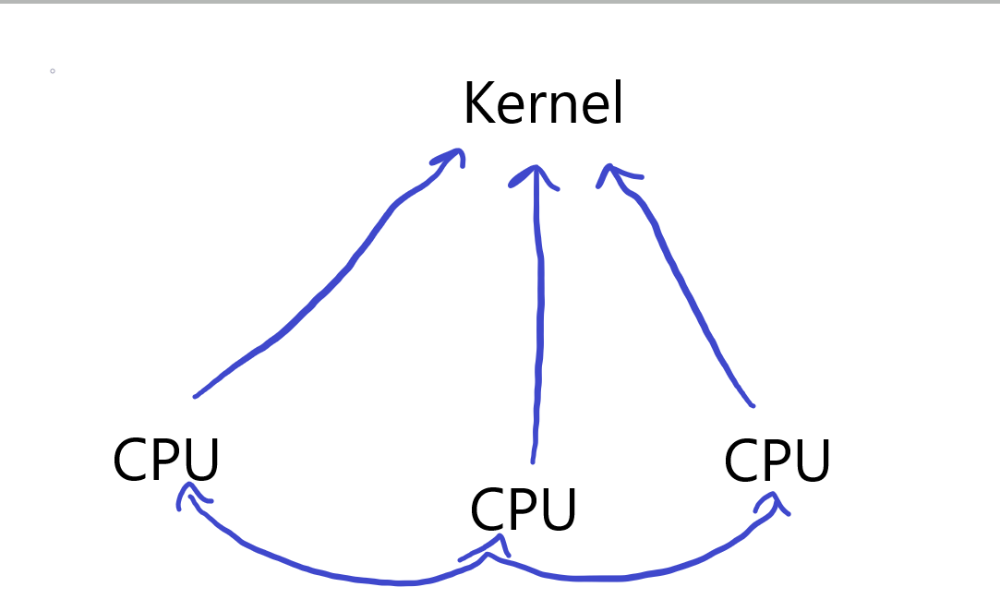

# Table of Contents
1. [Scheduling](#scheduling)
2. [Notifications](#notifications)
3. [Memory Portals](#memory-portals)
4. [Events](#events)

# Scheduling

We utilise a per-processor scheduling server that interacts with the kernel over a circular queue located within shared memory, used for passing schedulable objects. It is the responsibility of the kernel to context switch, while it is the responsibility of the user-space scheduling server to inform the kernel of what to schedule. When the kernel depletes this queue, it shall reschedule to the pre-processor scheduling server which will then refill this queue and yield. We implement a Completely Fair Scheduler, where each thread enqueued is the next left-most node within a Red-Black tree with respect to virtual runtime. And we use the invariant TSC, with the HPET set to backup, to update our runtime.



To allow for efficent load-balancing and communication between schedulers, information and metadata are exchanged between servers via a protal link. Where the servers `processor_id` acts as an index into shared memory which points to its respective metadata structure. 

The notifications `NOT_SCHED_ENQUEUE` and `NOT_SCHED_DEQUEUE` allow for the enqueuing and dequeuing of threads owned by a scheduler server. When a `NOT_SCHED_ENQUEUE` notification is invoked, it can trigger an additional notification to off-load the thread to another server to ensure balanced load between processors.

A thread is represented by a `context`, and a `context` is in essence just a set of states all unified around a single address space. These states are referred to as `ucontexts`. These `ucontexts` are maintained in the form a priority queue, that we pop from when possible to get the next schedulable ucontext. This allows for a dynamic morphology of threading. When you are blocking a thread, you are really just blocking on the active `ucontext` of that thread.

# Notifications

A notification is our primary interface used for RPC. To send a burst of infomration that require mutual processing between different contexts. A notification has an associated weight, which describes the priority in which it should be delivered. We support nested notifications.

- **NOTIFY_WEIGHT_INSTANTANEOUS**: Delivered instantaneously in a single continuous chain of execution.
- **NOTIFY_WEIGHT_TICK**: Delivered upon the next tick of the preemptive timer. 
- **NOTIFY_WEIGHT_SCHEDULED**: Delivered according to the weight of its destination

Each notification must have its own stack. But since the kernel has has minimal authority over the virtual address space of a user-space server, it is the responsibility of the server to supply these stacks. If we were to ever exhaust this repository of stacks, the kernel will invokve a notification `NOTIFY_USTACK_REFILL`. 

A notification handler exists in the following form, where the kernel passes the following paramaters:

```c
static void notification(struct notification_info *notificaion_info, void *data, int notnum) {
	...
	SYSCALL0(SYSCALL_NOTIFICATION_RETURN);
}
```

- **notificatino_info**: provides information about the sender and the nature of the invocation
- **data**: region allocated in shared memory for object passing
- **notnum**: the notification number

The `data` paramater is a region allocated in shared memory between both the caller and the notification allowing for bidirectional communication. When such bidirectional communication is unnecessary, the pages will be marked as non-writable within the address space of the notification. 

# Memory Portals

A user-space entity is assumed to have complete control over its virtual address space. But the kernel does provide an interface known as Memory Portals, that provide user-space with the ability to interact with its memory and the memory of the broader system at a more granular level. 

### Portal Class

Portals are each assigned a composite of classes that descibe the behaviour of the portal. Often certain portal classifications are only accessible by special categories of server. A memory portal may belong any combination of the following classifications

- **Share**: Establishes a region of shared memory between servers used for special types of protected IPC.
- **Direct**: Is used to create a direct map for a specified region in physical memory, mainly used for mapping MMIO.
- **Anon**: Creates an anonymous mapping of a specified size.
- **Cow**: A set of frames and references to be fulfilled in accordance with respect to Copy on Write.
- **Special**: A special mapping for whose contents must be inferred from a specified chain of interactions between servers.

### Portal Link over Shared Memory

We provide an interface that is intended to encapsulate a region of shared memory known as `Portal Links`, intended to ensure safety, as well as provide some utilities. It is both the responsibility of the client and server to understand the nature of the data being passed over shared memory. FAYT will provide macros and wrappers for data access to ensure safety.

The kernel will maintain a table describing all shared memory portals. Each with an identifier, a list of the captured threads, and a pointer to the physical memory of the shared object.

To create a share-point, you will create a portal under the classification ANON (or DIRECT) and SHARE. You will provide a name identifying the share-point, and pass a proper morphology. Then the caller will populate it with the share objects.

For any share-point, the first bytes will always be a meta-structure understood by all parties to be a governing object used for synchronization which is defined as:

```c
struct [[gnu::packed]] portal_link {
	int lock;
	
	unsigned int length;
	unsigned int header_offset;
	unsigned int header_limit;
	unsigned int data_offset;
	unsigned int data_limit;
	unsigned int magic;
	
	char data[];
};
```

All operations performed adjacent to this link, will be required to be routed through a macro known as `OPERATE_LINK(LINK, CLASS, OPERATION)` where LINK is assumed to be a pointer to the portal, CLASS assumed to be the class of link (LINK_CIRCULAR, LINK_VECTOR, LINK_RAW, ...), and OPERATION assumed to be a statement expression that perform the operation. An example is shown below:

```c
int ret = OPERATE_LINK(link, LINK_CIRCULAR,
	({
		struct thread *thread;
		int ret = traverse_and_queue(&thread);
		if(ret != -1) ret = circular_queue_push((void*)link->data, thread);
		ret;
	})
);
```

The contents of the share-point begins at the next 16-byte aligned address following this meta-structure. All access to the share-point will be understood to only be accessed by a set of wrappers that ensure all locking, protection, and boundary conditions are respected.

# Events

Within the kernel, we implement a protocol known as `equeue`, that provides the ability to block, and then wake, a set of threads based on a set of arbitrary conditions. You attach triggers, created by instantiating an `etrigger`, to various `equeues`. A trigger is capable of being activated in any context. These triggers are capable of waking all those currently blocking on any attached `equeue`. The following is an example of how the protocol is intended to be used:

```c
struct equeue equeue;

for(a; b; c) {
	equeue_add(&equeue, possible_trigger);
}

for(;;) {
	if(condition) break;
						      
	struct equeue_trigger *waking_trigger;
	int ret = equeue_block(&equeue, &waking_trigger);
	if(ret == -1) return -1;
}
					  
for(a; b; c) {
	equeue_remove(&equeue, possible_trigger);
}
```

You add trigger sources to the queue. Then you block on the queue and the active ucontext is dequeued. If unblocked by a trigger, it will confirm that the condition of interest has been satisfied, if not it will block again. Depending on your morphology of queues and triggers, near any configuration of blocking is possible.
